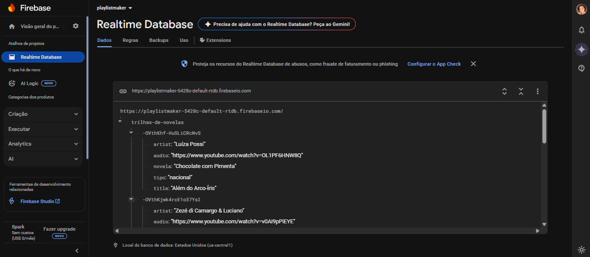

# Minha Trilha | PlaylistMaker App
Aplicação fullstack de criação e gerenciamento de playlists de músicas.

## Funcionalidades
- Busca por faixas, artistas e novelas
- Player de áudio integrado com YouTube (sem exibir o vídeo)
- Playlist persistente por dispositivo (via deviceId)
- Cache local com expiração automática
- Diagnóstico local e limpeza de cache facilitada
- Adição e remoção de faixas da playlist com drag-and-drop

## Como executar localmente
```bash
git  clone  https://github.com/ericanoronha/playlistmaker
cd  playlistmaker  &&  npm  run  install:node
```
```bash
npm  run  dev:fullstack
```
```bash
npm  run  test:backend
```
```bash
npm  run  build:frontend
npm  run  start:backend
```
```bash
docker-compose  up  --build
```

Acesse o app em: [http://localhost:5173](http://localhost:5173).

---

## Deploy automático
- Configurado via GitHub Actions e Docker Hub
- A imagem é publicada em `ericanbezerra/playlistmaker`
- O Render consome essa imagem automaticamente
---



---
##  API REST (Express)

| Método | Rota | Descrição |
|--|--|--|
| GET | `/api/songs` | Lista todas as faixas |
|GET|`/api/playlist/:deviceId`|Playlist do dispositivo|
|POST|`/api/playlist/:deviceId`|Adiciona faixa à playlist|
|DELETE|`/api/playlist/:trackId?deviceId=...`|Remove faixa específica|
|PUT|`/api/playlist/reorder/:deviceId`|Reordena a playlist|

## Stack
### Frontend

-   React 18 + Vite
-   Material UI (MUI)
-   react-youtube (embed YouTube)
- ~~shaka-player (para DASH - não usado atualmente, acabei optando pelo react-youtube)~~

### Backend
-   Node.js + Express
-   Firebase Admin SDK (Realtime Database)
-   Jest + Supertest (testes)

### DevOps
-   Docker + docker-compose
-   GitHub Actions (CI/CD)
-   Render.com (deploy)

Feito com ♡ por [@ericanoronha](https://github.com/ericanoronha)
